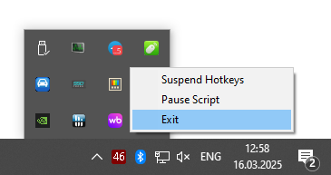

```sql
 ▄█     █▄  ▀█████████▄          ▄████████  ▄████████ ███    █▄ 
███     ███   ███    ███        ███    ███ ███    ███ ███    ███
███     ███   ███    ███        ███    █▀  ███    █▀  ███    ███
███     ███  ▄███▄▄▄██▀         ███        ███        ███    ███
███     ███ ▀▀███▀▀▀██▄       ▀███████████ ███        ███    ███
███     ███   ███    ██▄               ███ ███    █▄  ███    ███
███ ▄█▄ ███   ███    ███         ▄█    ███ ███    ███ ███    ███
 ▀███▀███▀  ▄█████████▀        ▄████████▀  ████████▀  ████████▀
```               

## Описание

Этот скрипт позволяет быстро открывать страницы товаров на Wildberries, извлекая артикулы из выделенного текста. Работает в любой программе, где можно выделить текст и скопировать его в буфер обмена.

## Возможности

- Автоматически извлекает артикулы (только числа длиной от 4 символов).
- Поддерживает любые разделители (пробел, запятая, точка и т. д.).
- Открывает найденные артикулы в браузере по ссылке:  
  `https://www.wildberries.ru/catalog/{article}/detail.aspx`
- Сохраняет и восстанавливает содержимое буфера обмена.

## Установка

1. Скачайте последний релиз с [GitHub Releases](https://github.com/SheerGeyser/wb_scu_opener/releases/tag/v1.0.2).

## Использование

1. Выделите текст, содержащий артикулы Wildberries.
2. Нажмите `Ctrl + Shift + W`.
3. Скрипт автоматически откроет вкладки в браузере с найденными артикулом.
4. Чтобы закрыть скрипт, выберите его иконку в трее, нажмите правой кнопкой мыши и выберите **Exit**.

   
## Требования

- **Браузер по умолчанию** (скрипт использует команду `Run()` для открытия ссылок).

## Обратная связь

Если нашли баг или у вас есть предложения, создайте [issue на GitHub](https://github.com/SheerGeyser/wb_scu_opener/issues).  
